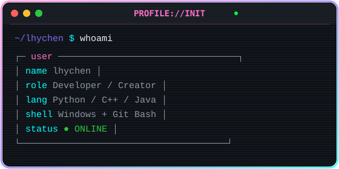

<!-- ========== HEADER ========== -->

<!-- Cyber City Banner -->

<h1>lhychen</h1>
<h3 style="color:#7B68EE;">★ CYBER ANIME DEVELOPER ★</h3>

<!-- Typing SVG -->

<!-- Neon Divider -->

<!-- ========== ABOUT ME ========== -->

###  `PROFILE://INIT` 

 

<!-- ========== INTERESTS ========== -->

###  `INTERESTS://DECRYPTED` 

<table align="center">
  <tr>
    <td align="center" width="25%">
      
       
      <b><code>ANIME://FAVORITE</code></b>
       
      ワンピース / FAIRY TAIL
       
      NARUTO -ナルト-
    </td>
    <td align="center" width="25%">
      
       
      <b><code>GAME://ONLINE</code></b>
       
      Counter-Strike 2
    </td>
    <td align="center" width="25%">
      
       
      <b><code>CODE://PASSION</code></b>
       
      算法竞赛
       
      开源项目 / 技术探索
    </td>
    <td align="center" width="25%">
      
       
      <b><code>HOBBY://ACTIVE</code></b>
       
      篮球 / 运动
       
      生活不止代码
    </td>
  </tr>
</table>

<!-- ========== TECH STACK ========== -->

###  `SKILL://LOADOUT` 

 

 

<!-- ========== GITHUB STATS ========== -->

###  `STATS://DASHBOARD` 

 

 

<!-- ========== ACTIVITY GRAPH ========== -->

<!-- ========== FOOTER ========== -->

 

**`> "In the cyber world, every line of code is a brush stroke on the canvas of the future."`**

 

